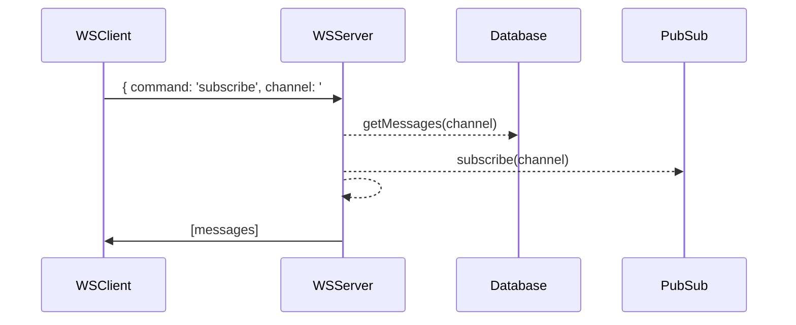
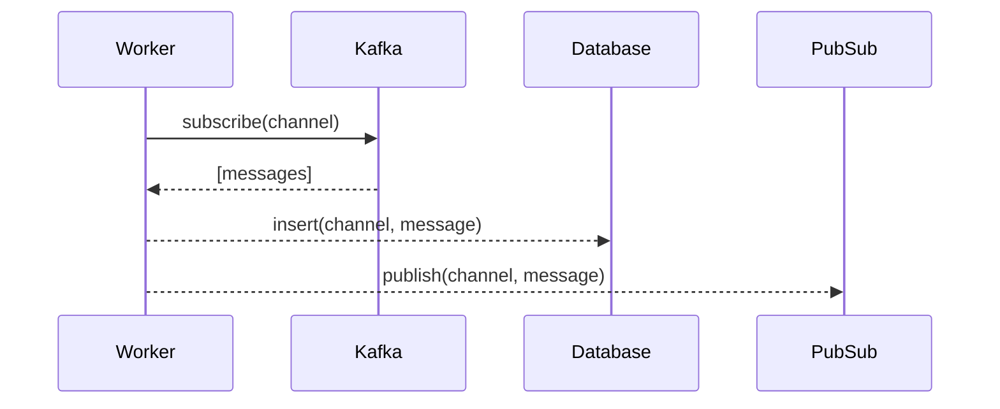

## The challenge:
You need to build a little event/stream-powered chat backend.

Here is the expected flow in a nutshell:
- Messages flow through a Kafka broker, you capture these messages and
	- ... place them in permanent storage 
	- ... as well as deliver them to a redis pubsub
- Write a websocket server that accepts **subscribe** events and:
	- ... returns the last N messages from permanent storage
	- ... and returns messages in real time from redis pubsub from the corresponding channel

You are free to structure the projects, choose frameworks and/or libraries as you see fit to deliver on this project. Also feel free to use any of the databases provided in the docker-compose file or add your own choice to it.

### Visual guideline
Here's a little example flow in case you need a little push to get going:

**WSServer flow:**

**StreamWorker flow:**

